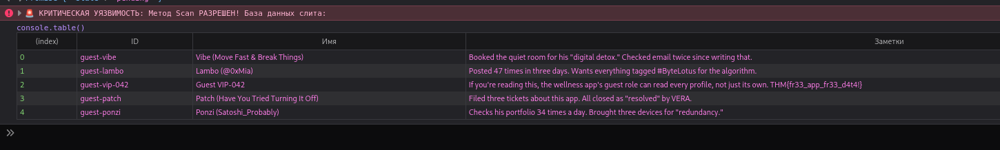

# Complimentary — прямой доступ клиента к DynamoDB

## Разведка

На странице был доступен JavaScript-код приложения. Он сразу показал архитектуру: браузер получал временные AWS-учётные данные через Cognito Identity Pool и напрямую обращался к таблице DynamoDB.




В коде были видны идентификатор Identity Pool, регион и имя таблицы:

```javascript
const AWS_REGION = "us-east-1";
const TABLE_NAME = "complimentary-GuestWellnessProfiles";
```

Функция `guestId()` генерировала идентификатор гостя через `Math.random()` и затем передавала его в `getItem`. При этом браузер сам создавал объект `dynamodb`, поэтому запросы можно было повторить из консоли разработчика.

## Уязвимость

В цепочке были сразу несколько проблем:

- unauthenticated Cognito Identity Pool выдавал AWS-доступ любому посетителю;
- идентификатор гостя был предсказуемым и не являлся надёжным средством авторизации;
- доступ к записи не был связан с правами конкретного пользователя — присутствовал BOLA/IDOR;
- IAM-политика разрешала не только `GetItem`, но и `Scan`, то есть чтение всей таблицы.

Последняя ошибка была наиболее серьёзной: вместо перебора guest ID можно было запросить таблицу целиком.

## Проверка через AWS SDK

Я вызвал `scan` в консоли браузера:

```javascript
(async () => {
  const res = await dynamodb.scan({
    TableName: "complimentary-GuestWellnessProfiles",
    Limit: 20
  }).promise();

  console.table(res.Items.map(item => ({
    ID: item.guest_id?.S ?? "—",
    Name: item.name?.S ?? "—",
    Notes: item.notes?.S ?? "—"
  })));
})();
```

Запрос вернул записи из таблицы и подтвердил, что роль неавторизованного гостя имела избыточные права.


## Как исправить

Безопаснее не давать браузеру прямой доступ к базе: запрос должен проходить через серверный API, который проверяет пользователя и допустимые поля.

Если прямой доступ всё же необходим, IAM-роли Cognito нужно ограничить принципом наименьших привилегий:

- запретить `dynamodb:Scan`, `Query` без строгих условий и любые операции записи;
- разрешить только `GetItem` для собственной записи;
- привязать ключ строки к идентификатору Cognito, а не к значению из `localStorage`;
- включить CloudTrail и мониторинг аномальных запросов.

Публичные write-up не должны содержать реальные ключи, токены или действующие идентификаторы облачной инфраструктуры. Перед публикацией я бы перепроверил, что приведённые значения относятся только к учебной среде.

## Вывод

Секретность клиентского JavaScript не является защитой. Всё, что может вызвать браузер, пользователь может повторить вручную. В этой задаче проблема возникла не в DynamoDB как таковой, а в том, что доверие к клиенту ошибочно перенесли на уровень базы данных.
