# Brooklyn Nine-Nine — CTF Writeup

## Разведка (Nmap)

Проводим первоначальное сканирование сети.

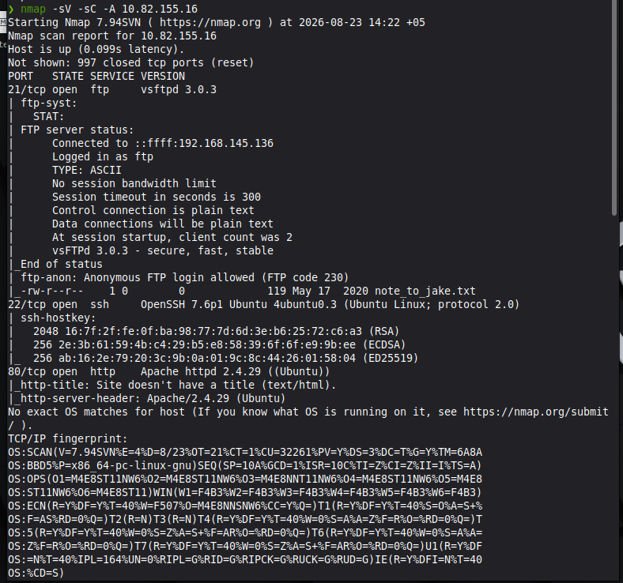

Сразу бросается в глаза открытый FTP порт, и nmap указал, что в него можно зайти через anonymous.

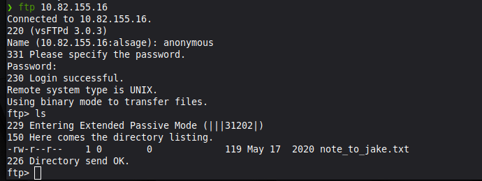

## FTP

Видим, что на FTP лежит записка (Записка для Джейка). Выгрузим её себе на систему.

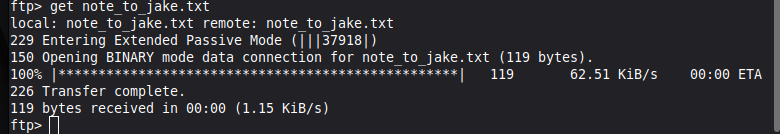
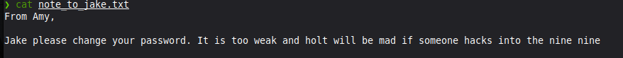

Перевод: *"Джейк, пожалуйста, смени пароль. Он слишком слабый, и Холт будет в ярости, если кто-нибудь взломает систему 99-го участка."*

На данный момент это мало что даёт, перейдём к 80 порту и зайдём на сайт.

## Веб (порт 80)


Перевод: *"В этом примере создаётся фоновое изображение на всю страницу. Попробуйте изменить размер окна браузера, чтобы увидеть, как оно всегда заполняет весь экран (при прокрутке в самое начало) и корректно масштабируется на экранах любого размера."*

Зайдём в DevTools (`F12`). Видим подсказку:

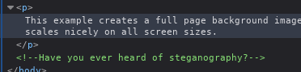

Скачаем картинку и попробуем её изучить.

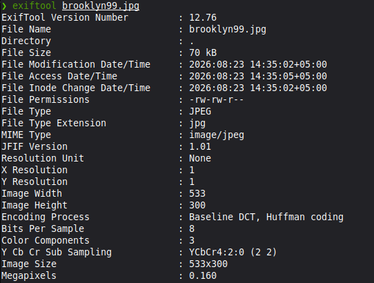

`exiftool` особо ничего не дал. Попробуем другой вариант — `steghide`.

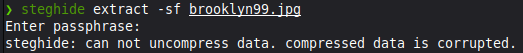

Нужен пароль. Пробуем взаимодействовать через `stegseek`.

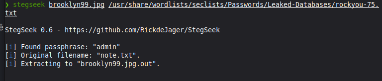

Как видим, `stegseek` нам помог.

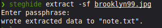

Выгрузим, что было в картинке, через `steghide`, указав найденный пароль `admin`.

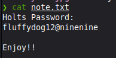

Вот и пароль — **`fluffydog12@ninenine`**.

## SSH

Если вернуться назад, вспомним, что открыт SSH — думаю, стоит попробовать подключиться через него с полученными данными.

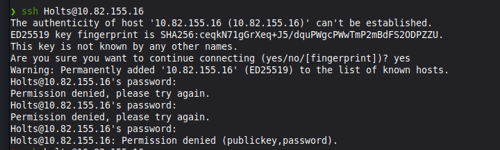

Найденный юзер не подходит, но в этом сериале Brooklyn 9-9 фамилия капитана пишется как **Holt**:

- user: `holt`
- pass: `fluffydog12@ninenine`

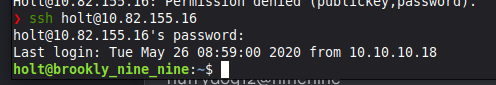

Успех, знакомимся со системой и смотрим, кто мы, где мы и что нам можно.

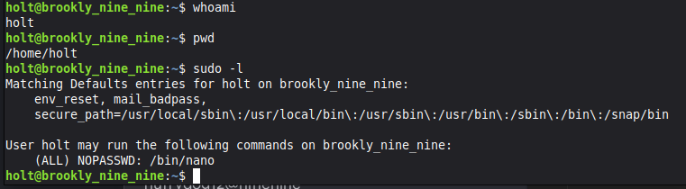

Сразу забираем первый флаг.

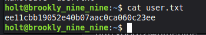

## Privilege Escalation

Видим, что нам разрешена команда `nano` от имени root. Сразу же воспользуемся этим.

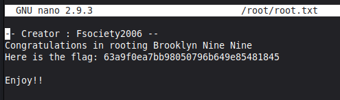

**Флаги:**

```
flag 1 - ee11cbb19052e40b07aac0ca060c23ee
flag 2 - 63a9f0ea7bb98050796b649e85481845
```

## Lessons Learned

1. **Steganography Automation** — в CTF-задачах на стеганографию всегда начинай с `stegseek` вместо `steghide`. Разница в скорости перебора словаря колоссальная (секунды против часов), особенно при использовании больших wordlist'ов вроде `rockyou.txt`.

2. **Contextual Enumeration** — не игнорируй подсказки в контенте сайта. Фраза "Look in the dark" и наличие одинокой картинки в DevTools были прямыми индикаторами скрытых данных. В пентестинге контекст важнее автоматического сканирования.

3. **FTP Anonymous Access** — открытый анонимный FTP это часто не просто уязвимость, а источник первичной разведки. Записки, конфиги или старые бэкапы там встречаются чаще, чем прямые шеллы. Всегда проверяй права на запись/чтение.

4. **Privilege Escalation via Editors** — право запускать текстовые редакторы (`nano`, `vim`) от root эквивалентно полному доступу к системе. Это классическая misconfiguration, которую легко эксплуатировать через встроенные shell-команды (`:!sh` или `Ctrl+R Ctrl+E`).

5. **Lateral Movement** — успешный вход по SSH после получения пароля из стеганографии подтверждает важность проверки всех сервисов. Пароль, найденный в картинке, может быть ключом к другому пользователю (Holt), о котором нет явных упоминаний в веб-приложении.
