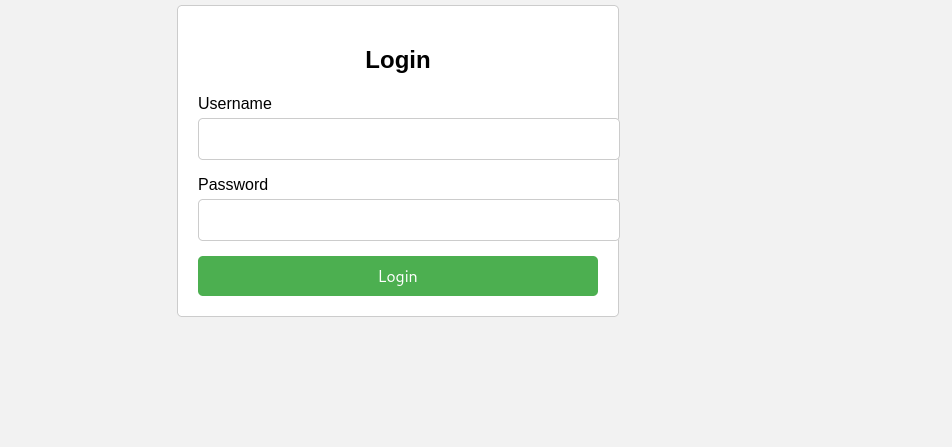
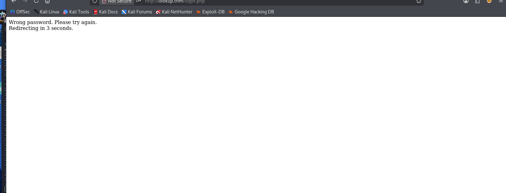
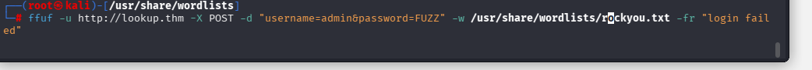
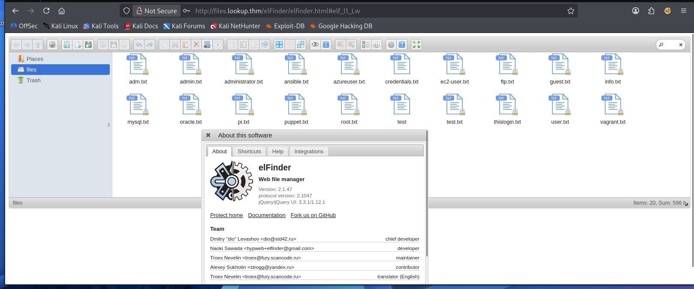
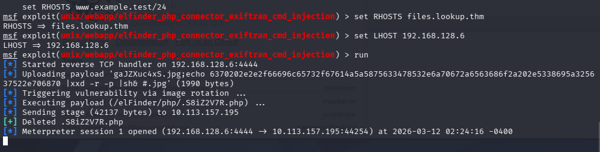
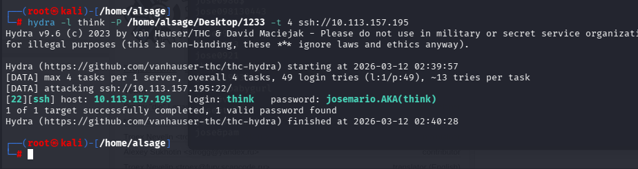
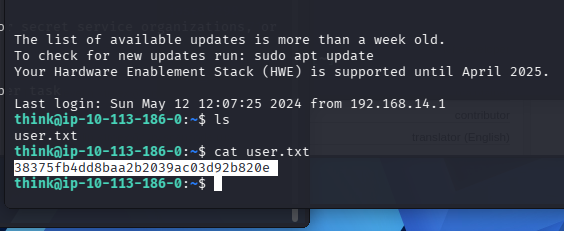
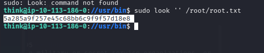

Просканировав машину узнаем что открыт порт 80,отвечающий за веб.
Перейдя на него видем форму логина-пароля.
Попробав зайти по username-Admin,пишет что неправильный пароль,понимаю что сайт сам выдает верных юзеров.

Перебрав из словаря логины,нашелся новый логин jose.Узнав логин пробую забрутить пароль.
Все прошло успешно,на выходе получаем учетную запись
username - jose
password - password123

После авторизации нас перекинуло на какой то файловый менеджер,первым делом узнаю что это такое и какой оно версии.в интернете поискав понял что версия уязвима.

Через metasploit попробовал провести эксплуатацию.Успешно!
Была установлена сессия.После установил еще один RevShell,так как от метасплоита не особо удобный.
Часть 1. Как мы получили список пользователей (Эксплуатация SUID)

В системе был обнаружен бинарный файл `/usr/sbin/pwm`. У него был установлен SUID-бит. Это значит, что кто бы ни запустил этот файл (даже обычный веб-пользователь `www-data`), программа выполняется внутри системы с максимальными правами — от имени суперпользователя `root`.

## 1. Обнаружение уязвимости (Уязвимый вызов `id`)

Программа `pwm` была написана с ошибкой. При старте она хотела узнать имя текущего пользователя и выполняла команду проверки `id`. Но разработчик написал в коде просто `id`, вместо указания абсолютного пути `/usr/bin/id`.

Когда Linux видит команду без точного пути, он начинает искать этот файл по очереди во всех папках, которые прописаны в системной переменной окружения `PATH` (например, `/usr/bin`, `/bin`, `/usr/sbin`).

## 2. Подмена файла

Мы воспользовались этим и создали свой собственный вредоносный файл с именем `id` в папке `/tmp/`.  
Затем мы изменили переменную `PATH` для нашей текущей сессии:

```bash
export PATH=/tmp:$PATH
```

Этим действием мы сказали системе: _«Если какая-то программа ищет утилиту, сначала загляни в папку `/tmp`, и только потом во все остальные»_.

## 3. Обман программы `pwm`

Когда мы запустили `/usr/sbin/pwm`, программа решила проверить права, обратилась к команде `id`, но из-за измененного `PATH` запустила наш текстовый скрипт `/tmp/id`.

Поскольку сам `pwm` работал от имени `root`, наш скрипт `/tmp/id` тоже выполнился с правами `root`. Внутри этого скрипта мы заставили систему сгенерировать строку:

```bash
uid=1000(think) gid=1000(think) groups=1000(think)
```

Программа `pwm` прочитала этот текст, поверила, что её запустил пользователь `think`, сама зашла в его защищенную домашнюю директорию `/home/think/`, прочитала скрытый файл `.passwords` и вывела весь этот огромный список учетных записей прямо нам в терминал.

## 4. Как мы скопировали и сохранили список

Чтобы не потерять эти данные и не читать их вручную с экрана, мы перенаправили стандартный вывод (stdout) программы `pwm` в файл. Символ `>` в Linux отвечает за запись вывода команды в текстовый файл:

```bash
/usr/sbin/pwm > /tmp/passlist.txt
```

После этого утилита `sed` удалила из файла служебные строки (информацию о запуске), оставив в `/tmp/passlist.txt` только чистый список имен и паролей, готовый к перебору.
Дальше было два пути по которым можно пройти дальше.
Это как на скриншоте перебрать пароли для более стабильного шелла через ssh.
Либо же рабоать через тот же RevShell.

Проверив что может делать наш новый юзер think,я увидел что он может от рута запускать утилиту look.
Утилита **`look`** — это встроенный инструмент командной строки в Unix-подобных операционных системах (Linux, macOS), который используется для быстрого поиска слов или строк, начинающихся с определенного префикса.
Сама по себе утилита не предназначена для чтения файлов,как команда cat.Однако можно перехетрить утилиту и вывести текст из файла

**Команда:**  
`look "" имя_файла.txt`


